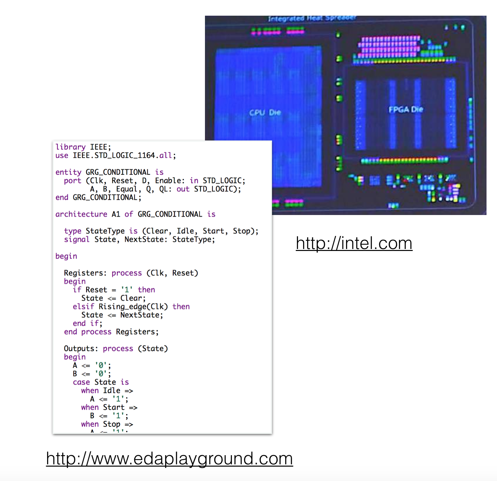
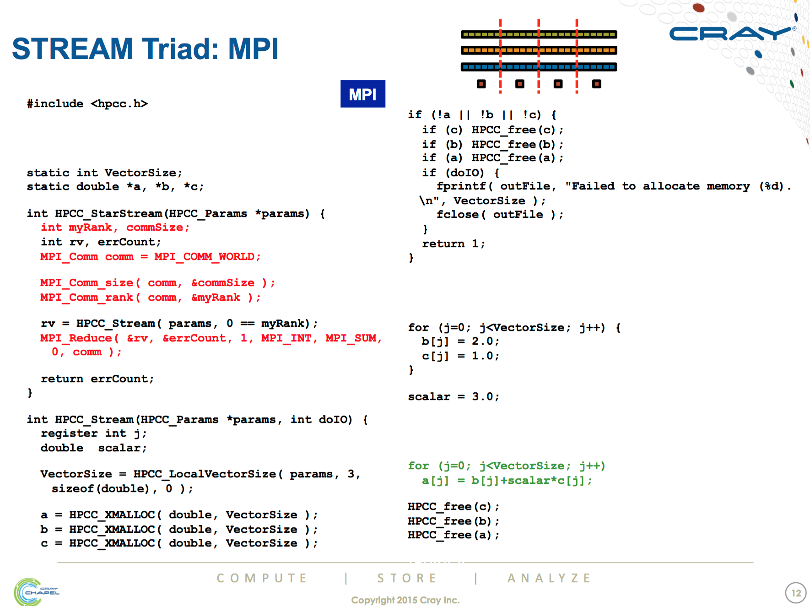
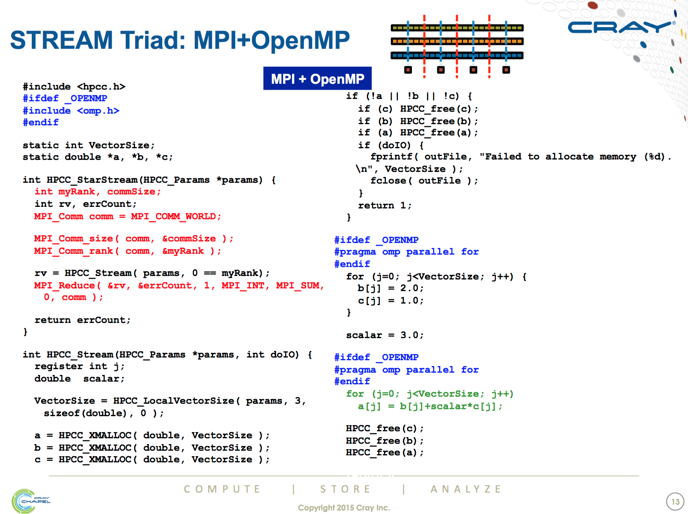
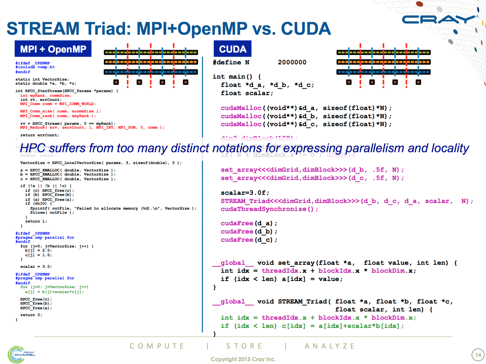
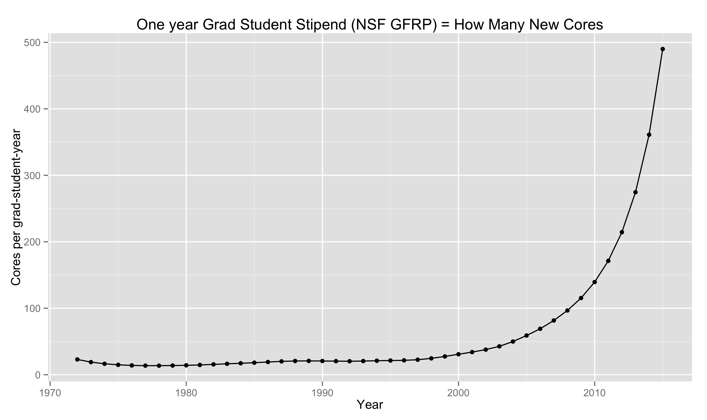
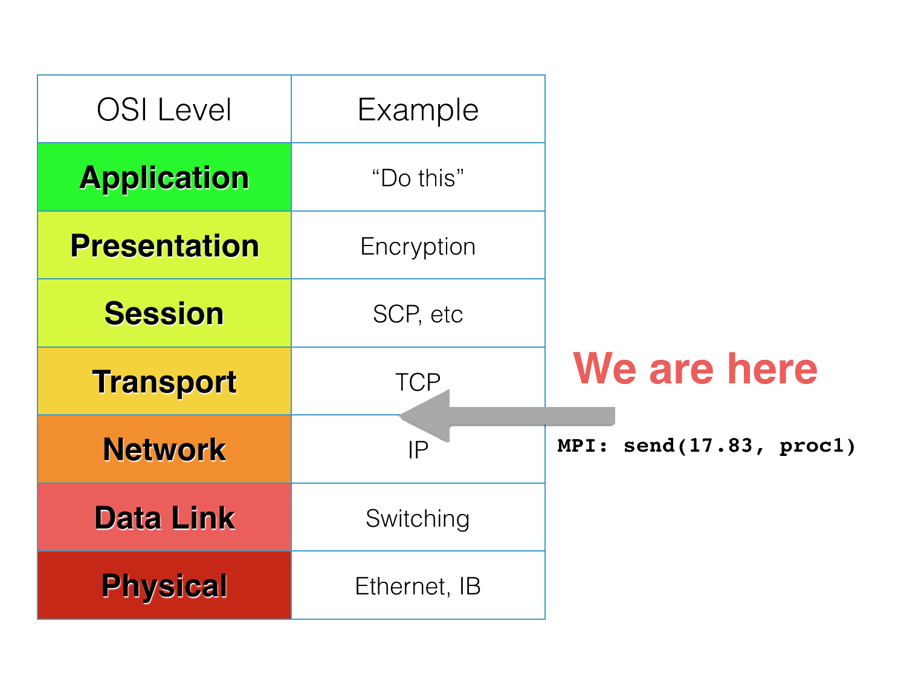
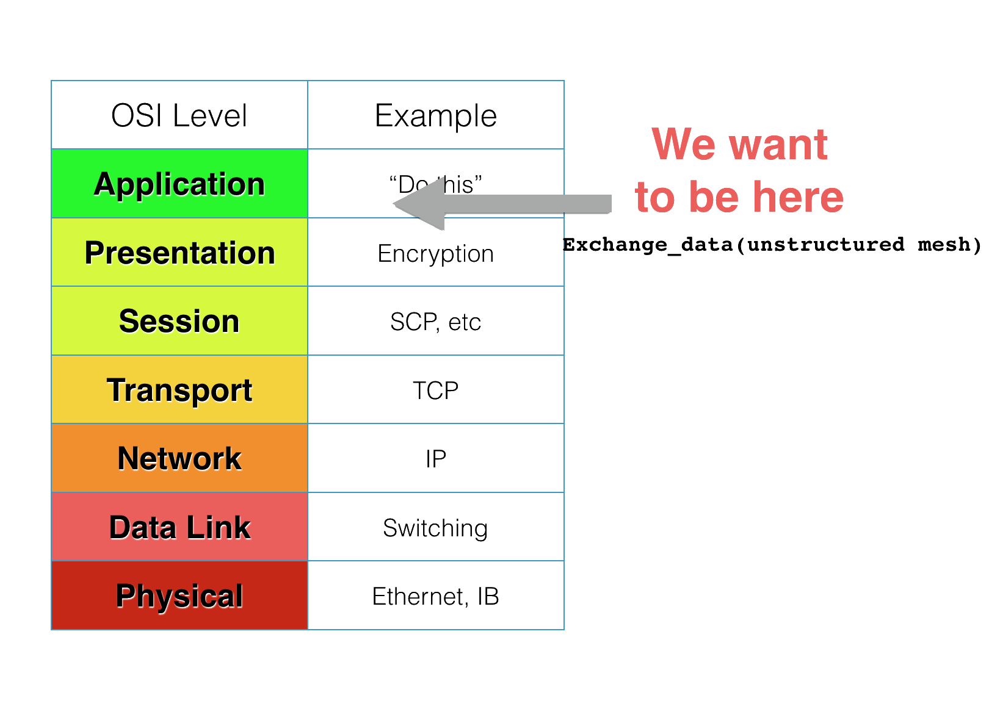

 

## Exciting Time to be Doing Large-Scale Scientific Computing!

Large scale scientific computing, 1995-2005 (ish):

* ~20 years of stability
* Bunch of x86, MPI, ethernet or infiniband
* No one outside of academia was much doing big number crunching

--- &twocol

## New Communities Make things Exciting

*** =left

* Internet-scale companies (Yahoo!, Google)
* Very large-scale image processing
* Machine learning:
  * Sparse linear algebra
  * k-d trees
  * Calculations on unstructured meshes (graphs)
  * Numerical optimization
* Building new frameworks

*** =right

--- &twocol

## New Hardware Makes things Exciting!

*** =left

* Now:
  * Large numbers of cores per socket
  * GPUs/Phis
* Next few years:
  * FPGA (Intel: Broadwell + Arria 10, shipping 2017)
  * Non-volatile Memory (external memory/out-of-core algorithms)

*** =right

---

## New Hardware Makes things Exciting?

---

## New Hardware Makes things Exciting?

---

## New Hardware Makes things Exciting?

---

## Programming Time is More Precious Than Compute

--- &twocol

## Programming Time is More Precious Than Compute

*** =left

And this only becomes more pronounced with other trends which make scientific programming harder:

* New variations of hardware
* New science demands: cutting edge models are more complex.  An Astro example:
    * 80s - gravity only N-body, galaxy-scale
    * 90s - N-body, cosmological
    * 00s - Hydrodynamics, cosmological
    * 10s - Hydrodynamics + rad transport + cosmological
    
*** =right

--- &twocol

## Things are currently harder than they have to be

*** =left

_Computational_ scientists have learned a lot about _computer_ science in the last 20+ years.
* Encapsulation
* Higher level programming languages (eg, python-as-glue)
* Code collaboration, sharing (github, etc)
* Division of labour - more distinction between people who work on libraries and people who build software that implements a scientific model

*** =right

--- &twocol

## We're programming at the transport layer...

*** =left

But our frameworks are letting us down.

MPI, which has served us very well for >25 years, is 90+% low level.  
* "Send 100 floats to task 7"
* Close to a network-agnostic sockets API (So maybe network level)
    - But a sockets API where everyone's browser crashes if a web server goes down.
* Assumptions made to make it easy for scientists to directly program in make it very difficult to build general frameworks upon (new MPI-3 one-sided stuff being an honourable exception)

*** =right

--- &twocol

## When we want to think about models, systems

*** =left

Programming at that level is worse than just hard.
* Makes the code very brittle.
* Changing how the data is distributed means completely rewriting every line of code that assumes the current distribution, communications pattern.
* &ldquo;I have an idea! I _think_ it will speed up the code 25%!  But it means rewriting 50,000 lines of code.&rdquo;
    - \#ExperimentsThatWillNeverHappen
* Makes it hard to take advantage of the opportunities new technologies present.

*** =right

---

## We know things can be better

be

---

